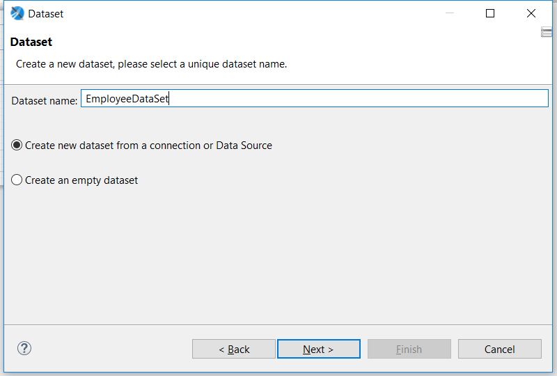

# JasperReport 使用总结 (Killua1@3)
网上的jasper report 文章实在太少，本着好记性不如烂笔头的原则，记录一下使用心得。本篇只是一些基本用法，深入用法需要进一步摸索。
# ① 开发工具介绍
Jaspersoft Studio，一个UI开发工具，能够快速的Preview效果的工具。
注意点是工具版本需要跟java中使用的版本一致，否则可能会出现兼容问题。
```java
<dependency>
    <groupId>net.sf.jasperreports</groupId>
    <artifactId>jasperreports</artifactId>
    <version>${net.sf.jasperreports.version}</version>
</dependency>
```
# ② 数据源配置
顾名思义就是报表中需要填充数据。jasper支持很多种数据源，最常用的有mysql中根据表结构来生成报表。在现在json流行的情况下，尽量使用json作为数据源。

个人习惯在创建报表之前就导入数据源。导入步骤如下： 右击`Data Adapter` -> `Create Data Adapter`


以下是测试数据
```json
{
	"user": {
        "uuid": 1,
        "username": "abcdefg",
        "avatar": "http://img.xxxx.com/avatars/1.jpg",
        "account": {
            "coins": 8888,
            "points": 9999
        }
    },
    "ordercount": { 
        "created": 0,
        "payed": 2,
        "delivered": 1,
        "completed": 18
    },
    "orders": [
        {
            "uuid": 1,
            "serial": "00001",
            "status": 2
        },
        {
            "uuid": 2,
            "serial": "00002",
            "status": 2
        }
    ],
	"employees": [
		{
			"id": 1,
			"name": "ann",
			"address": "yishun street11",
			"total": "800"
		},
		{
			"id": 2,
			"name": "john",
			"address": "yishun street21",
			"total": "900"
		}
	]
	
}
```

# ③ 创建report & sub report
### 1. 创建report 
File-> Jasper Report-> 填入report名字。
group功能暂不使用，导入需要的Fields.


### 2. 这里简单演示一下遍历数据，更多的功能可以查看右边Palette中的元素，可以自行研究。基本都是差不多的。




修改dateSource类型，从`REPORT_DATA_SOURCE`中获取
```java
((net.sf.jasperreports.engine.data.JsonDataSource)$P{REPORT_DATA_SOURCE}).subDataSource("employees")
```


### 3. 创建 SubReport


### 4. 选择Preview查看效果，就可以看见数据列表了

# ④ 导入中文字体
Jasper在生成报表时其实是使用的默认字体且只支持英文，如果要修改英文字体或者兼容中文字体，需要导入字体。
当java生成报表时，可以用maven或gradle导入，这样就能应用该字体了。

导入步骤：Windows-> Preferences -> Jaspersoft Studio -> Fonts -> Add

字体目前只支持四种，详细的参考下图。注意：PDF-encoding 一般设置为水平显示。


导入步骤：Windows-> Preferences -> Jaspersoft Studio -> Fonts -> Export
如果需要在java中生成报表，就导入这些字体jar。

```maven'
<dependency>
    <groupId>com.custom-fonts</groupId>
    <artifactId>Fonts</artifactId>
    <version>1.0.0</version>
    <scope>system</scope>
    <systemPath>${project.basedir}/src/main/resources/lib/FangSong.jar</systemPath>
</dependency>
```

# ⑤ i18n 多语言
### 1. 创建localization properties 文件，添加配置文件如下：


### 2. 导入i18n到report


### 3. 添加i18n资源文件


### 4. 预览i18n效果


### 5. properties 只支持ascii 编码格式，此处会转换成unicode编码，如果需要加载明文在java中，需要自行继承`ResourceBundle.Control`类，自定义解析。
```java
public class ExportResourceBundle extends ResourceBundle.Control {

    @Override
    public ResourceBundle newBundle(String baseName, Locale locale, String format, ClassLoader loader, boolean reload) throws IOException {
        String bundleName = toBundleName(baseName, locale);
        String resourceName = toResourceName(bundleName, "properties");
        ResourceBundle bundle = null;
        InputStream stream = null;
        if (reload) {
            URL url = loader.getResource(resourceName);
            if (url != null) {
                URLConnection connection = url.openConnection();
                if (connection != null) {
                    connection.setUseCaches(false);
                    stream = connection.getInputStream();
                }
            }
        } else {
            stream = loader.getResourceAsStream(resourceName);
        }
        if (stream != null) {
            try (InputStreamReader isr = new InputStreamReader(stream, StandardCharsets.UTF_8)){
                // Load resource bundle properties in UTF-8.
                bundle = new PropertyResourceBundle(isr);
            }
        }
        return bundle;
    }
}

@Test
public void testPostProcessorCN() {
    Locale localZhCN = new Locale("zh", "CN"); //Locale方言
    
    ResourceBundle resourceBundle = ResourceBundle.getBundle("i18n/reportLocalization", local, new ExportResourceBundle());
    
    JasperReport jasperReport = loadTemplate();
    Map<String, Object> parameters = new HashMap<>();
    
    parameters.put(JsonQueryExecuterFactory.JSON_INPUT_STREAM, jsonInputData); // json数据源
    parameters.put(JRParameter.REPORT_LOCALE, local);
    parameters.put(JRParameter.REPORT_RESOURCE_BUNDLE, resourceBundle);
}

private JasperReport loadTemplate() throws IOException, JRException, TemplateException {
    final InputStream resourceContent = new ClassPathXmlApplicationContext().getResource("classpath:main_report.jrxml").getInputStream();
    final JasperDesign jasperDesign = JRXmlLoader.load(resourceContent);
    return JasperCompileManager.compileReport(jasperDesign);
}
```

# ⑥ Jasper 外部样式
为了兼容更多的报表，可以将样式固定下来.让多个模块共享通用样式。

使用步骤：File -> New -> Style Template File


# ⑦ Java中使用

//TODO

