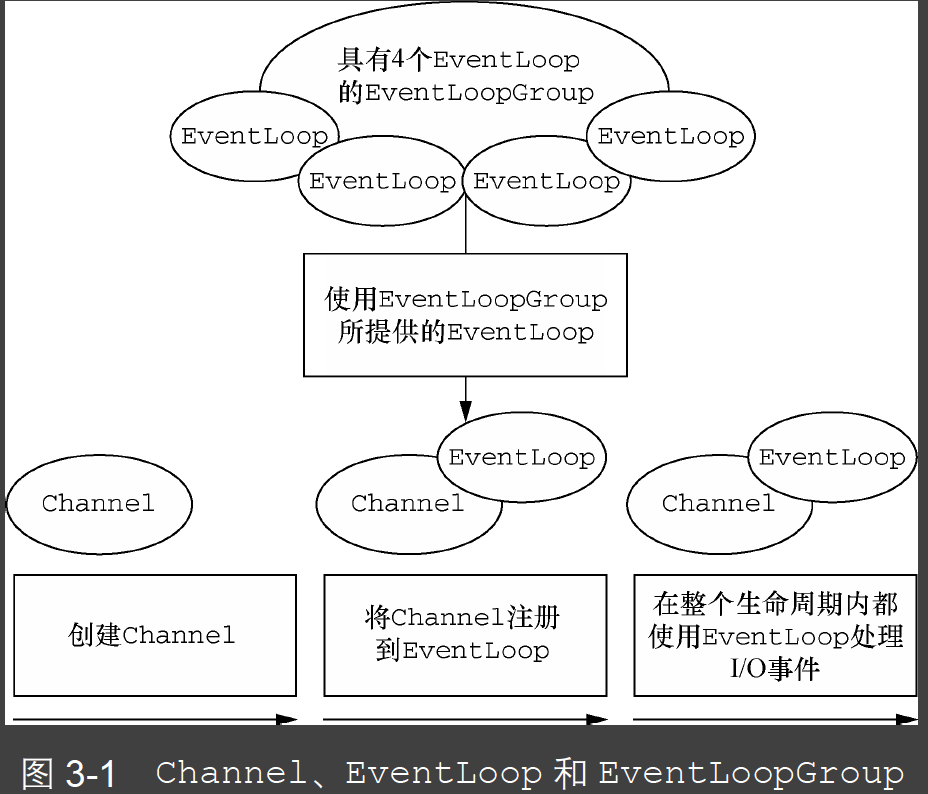

# Netty
## Channel、EventLoop 和ChannelFuture
 - Channel—Socket；
   - EmbeddedChannel；
   - LocalServerChannel；
   - NioDatagramChannel；
   - NioSctpChannel；
   - NioSocketChannel。
 - EventLoop—控制流、多线程处理、并发；
 - ChannelFuture—异步通知。
  
  

  缓冲区分配做大约1%的采样来检测内存泄露

```flow
st=>start: Start
op=>operation: Your Operation
cond=>condition: Yes or No?
e=>end

st->op->cond
cond(yes)->e
cond(no)->op
```