# 个人博客数据库设计
## 一 需求分析
### 1.  **系统概述**  
系统主要完成以下几方面的功能：  
- 网站管理：网站的基础设置和主题以及插件相关信息。
- 用户管理：用户的注册和登录，发表博文和评论，添加好友。
- 博文管理：用户可以在网站中发表和设置博文。
- 评论管理：用户可以评论博文和回复其他用户的评论。
- 分类管理：添加和删除分类，给文章设置分类。
- 标签管理：添加和删除标签，给文章设置标签。
- 论坛管理：发布和设置论坛信息，管理帖子。
- 友情链接：设置和发布友情链接。

### 2.  系统功能结构图
根据需求概述，得到系统功能结构图1如下所示：

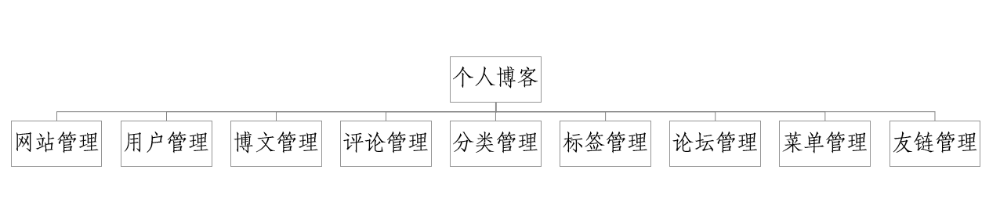
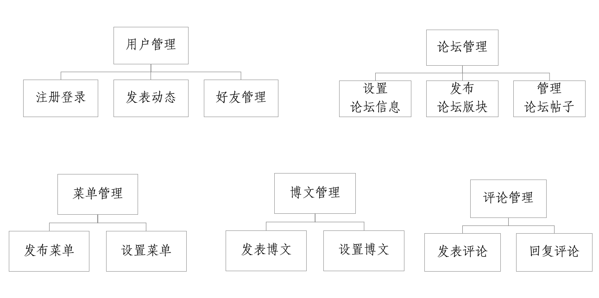  

系统功能结构图

**2.1  网站管理**  
- 网站拥有以下信息：网站标题、网站副标题、网站描述、网站ico图标、网站Logo、网站关键词、网站网址。
- 网站主要有以下设置：站点语言、日期格式、时间格式、是否允许用户注册等等。
- 只有管理员可以添加、删除、修改网站信息。

**2.2  用户管理**  
- 用户的相关信息如下：用户ID、用户IP、用户名、用户昵称、用户密码、用户邮箱、用户头像、-用户等级、用户权限、注册时间、用户生日、用户年龄、用户手机号。
- 用户注册时需提供用户名、用户密码、用户邮箱或用户手机号。
- 用户登录时可以采用用户名或邮箱或手机号进行登录。
- 用户可以发布博文、发表评论、发布帖子、回复帖子，还可以添加其他用户为好友。
- 用户级别分为管理员和普通用户，管理员普通用户都可以担当论坛版主。
- 管理员可以添加、删除、修改普通用户的任何信息，还添加、删除、修改任何论坛的信息。

**2.3  博文管理**  
- 博文的相关信息如下：博文ID、发布日期、发表用户、博文标题、博文内容、点赞数、回复数、游览量。
- 博文可以被普通用户发布、修改、删除和评论，但修改和删除仅限于自己发表的动态。
- 博文发布时需要设置分类、标签。

**2.4  评论管理**  
- 评论的相关信息如下：评论ID、评论日期、点赞数、发表用户、评论文章ID、评论内容、父评论ID。
- 评论可以被用户发表和删除以及被其他用户回复。

**2.5  分类管理**  
- 分类的相关信息如下：分类ID、分类名称、分类别名、分类描述、父分类ID。
- 只有管理员可以添加、删除、修改分类。
- 分类的作用不仅可以将文章分类，还可以作为博客的菜单。

**2.6  标签管理**  
- 标签的相关信息如下：标签ID、标签名称、标签别名、标签描述。
- 用户发表文章时可以设置标签，标签不仅可以将文章分类，还可以作为博客的菜单。

**2.7  论坛管理**
- 论坛相关信息如下：论坛ID、论坛名称、论坛描述、论坛Logo、论坛背景、论坛帖子个数、父论坛ID。
- 帖子相关信息如下:帖子ID、帖子标题、帖子内容、发帖时间、回帖个数、发表用户、帖子浏览量、帖子状态。
- 帖子回复相关信息如下。回贴ID、回帖用户、回帖内容、回帖时间、所属主贴ID、父回贴ID。
- 管理员可以设置论坛版主，版主可以设置该论坛下的子论坛版主，版主可以加精、置顶帖子、设置论坛信息。

**2.8  菜单管理**
- 总菜单的相关信息如下：菜单ID、菜单名称。
- 总菜单由子菜单组成，子菜单有以下信息： 链接ID、链接名称、链接目标、打开方式、父链ID。
- 只有管理员可以添加、删除、修改总菜单和子菜单。

**2.9  友链管理**
- 友链的相关信息如下：友链ID、友链链接、友链名称、友链描述、友链Logo。
- 只有管理员可以添加、删除、修改友链。

## 二 数据库概念模型设计
1. 网站管理
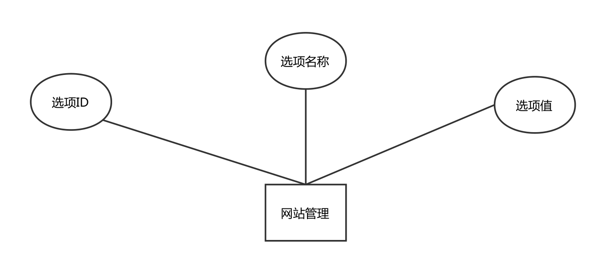

网站管理E-R图

2. 用户管理
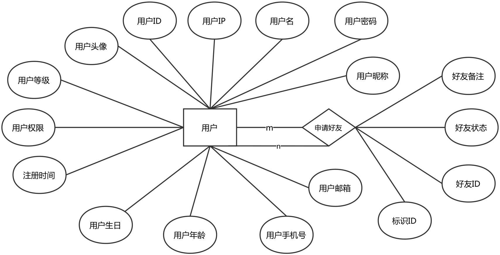

用户管理E-R图

3. 博文管理
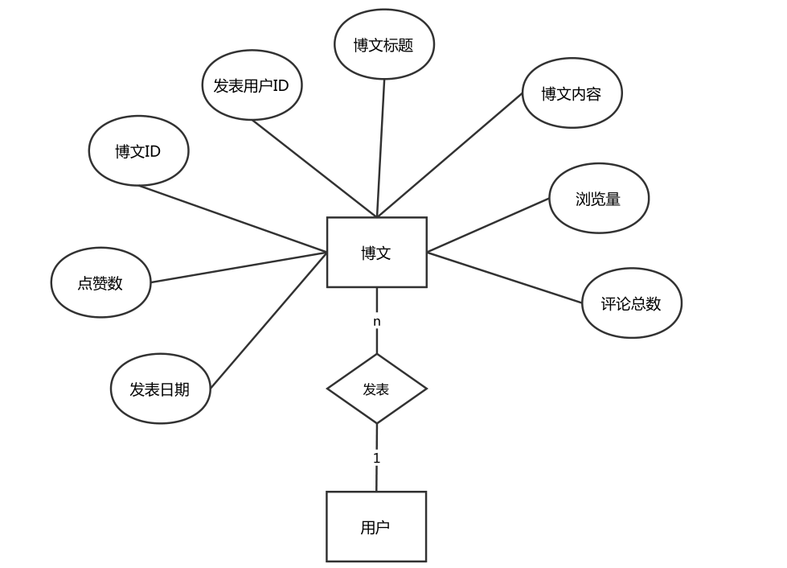

博文管理E-R图

4. 评论管理
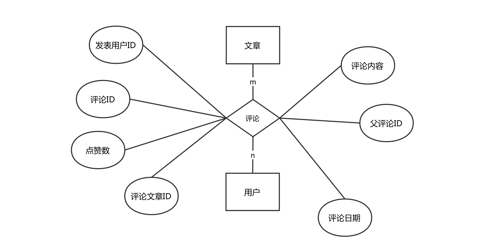

评论管理E-R图

5. 分类管理
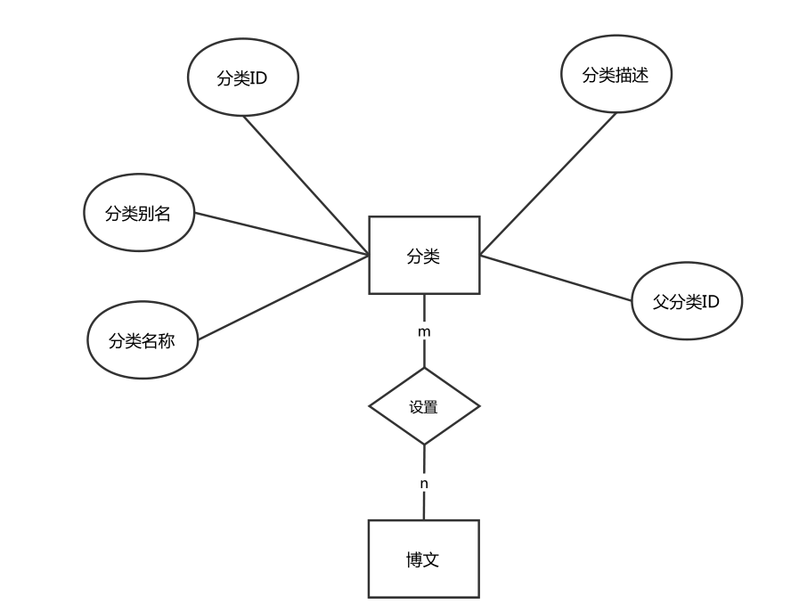

分类管理E-R图

6. 标签管理
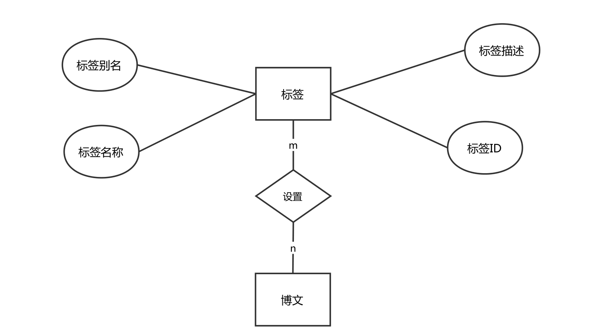

标签管理E-R图

7. 论坛管理
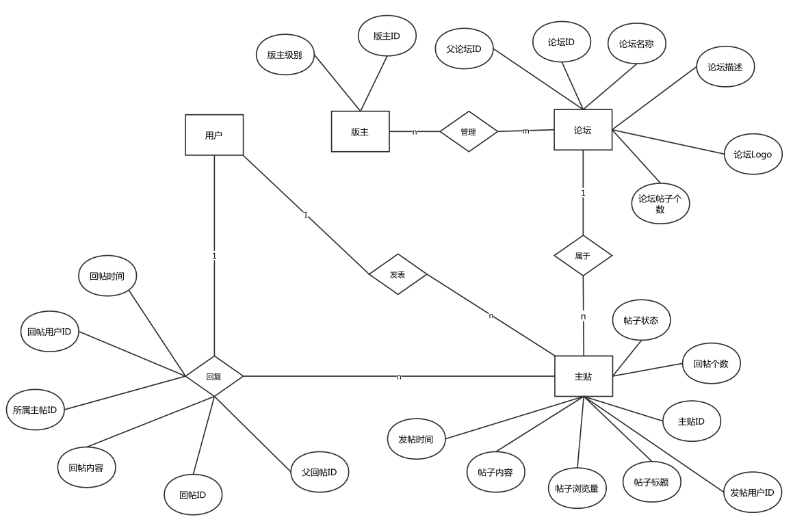

论坛管理E-R图

8. 菜单管理
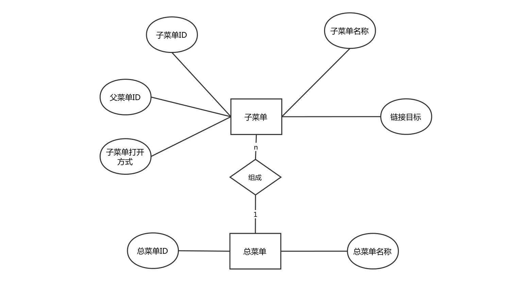

菜单管理E-R图

9. 友链管理
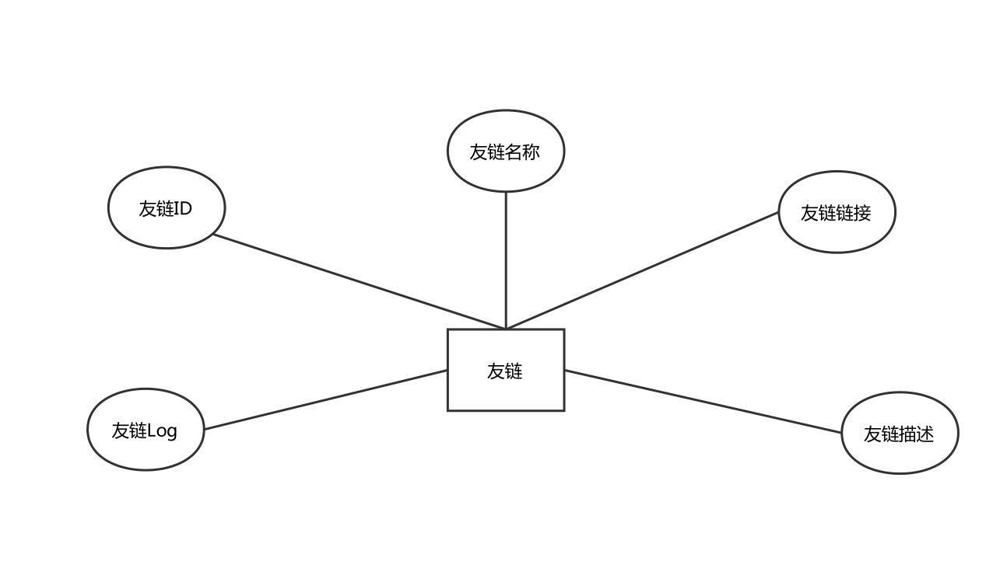

友链管理E-R图

10. 基本E-R图
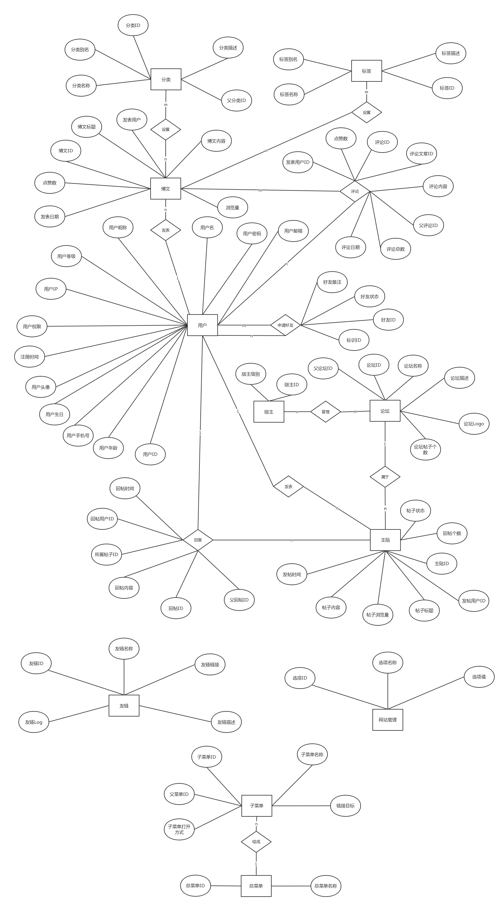

基本E-R图

## 三 数据库逻辑模型设计  

**1.  关系模式集合**
- 网站管理（选项ID，选项名称，选项值）
- 用户（用户ID，用户IP，用户名，用户密码，用户邮箱，用户昵称，用户头像，用户等级，用户权限，注册时间，用户生日，用户年龄，用户手机号）
- 用户好友（标识ID，用户ID，好友ID，好友备注，好友状态）
- 博文（博文ID，发表用户ID，博文标题，博文内容，浏览量，评论总数，发表日期，点赞数）
- 评论（评论ID，发表用户ID，评论文章ID，点赞数，评论日期，评论内容，父评论ID）
- 分类（分类ID，分类名称，分类别名，分类描述，父分类ID）
- 博文设置分类（博文ID，分类ID）
- 标签（标签ID，标签名称，标签别名，标签描述）
- 博文设置标签（博文ID，标签ID）
- 总菜单（总菜单ID，总菜单名称）
- 子菜单（子菜单ID，菜单ID，子菜单名称，子菜单链接，子菜单打开方式，父菜单ID）
- 论坛（论坛ID，论坛名称，论坛描述，论坛Logo，论坛帖子个数，父论坛ID）
- 主贴（主题ID，论坛ID，发帖用户ID，帖子标题，帖子浏览量，帖子内容，发帖时间，帖子状态，回帖个数）
- 回复帖子（回帖ID，回帖用户ID，所属主贴ID，回帖内容，回帖时间，父回帖ID）
- 版主（版主ID，论坛ID，版主级别）
- 友情链接（友链ID，友链链接，友链名称，友链描述，友链Logo）

**2. 数据库表结构设计**

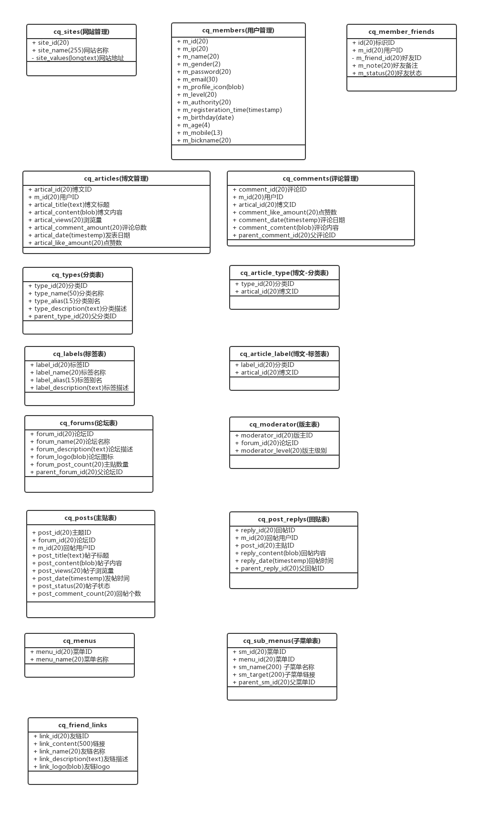