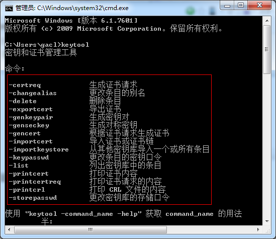
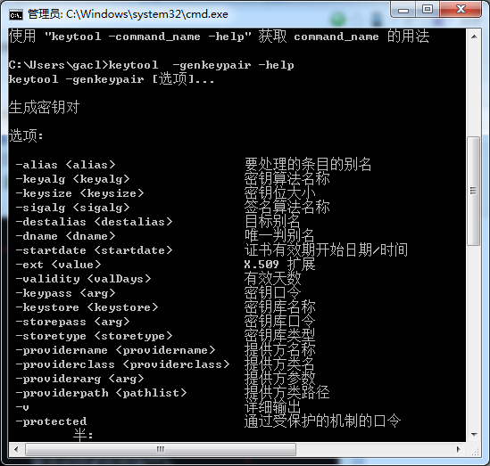

https://notes.mengxin.science/2018/10/03/all-knowledge-about-certificate-1/

https://github.com/downgoon/hello-world/wiki/keytoos-and-openssl

# Keytool create Certificate Create
## keytool的概念
keytool 是个密钥和证书管理工具。它使用户能够管理自己的公钥/私钥对及相关证书，用于（通过数字签名）自我认证（用户向别的用户/服务认证自己）或数据完整性以及认证服务。在JDK 1.4以后的版本中都包含了这一工具，它的位置为%JAVA_HOME%\bin\keytool.exe  

Keytool 是安全钥匙与证书的管理工具.它管理一个存储了私有钥匙和验证相应公共钥匙的与它们相关联的X.509 证书链的keystore(相当一个数据库). 

Keytool 是一个有效的安全钥匙和证书的管理工具. 它能够使用户使用数字签名来管理他们自己的私有/公共钥匙对,管理用来作自我鉴定的相关的证书,管理数据完整性和鉴定服务.它还能使用户在通信时缓存它们的公共钥匙. 

一个证书是某一实体(个人,公司等)的数字签名,指出其他实体的公共钥匙(或其他信息)的详细的值.当数据被签名后,这个签名信息被用来检验数据的完整性和真实性.完整性指数据没有被修改和篡改,真实性指数据从任何产生和签名的一方真正的传输到达. 

Keytool 把钥匙和证书储存到一个keystore.默任的实现keystore的是一个文件.它用一个密码保护钥匙. 而另外的一个工具jarsigner用keystore中的信息产生或检验Java aRchive(jar文件)中的数字签名. 

证书: 
   一个证书是一个实体的数字签名,指出其他实体的公共钥匙有明确的值. 
   1. 公共钥匙:是同一个详细的实体的数字关联,并有意让所有想同这个实体发生信任关系的其他实体知道.公共钥匙用来检验签名; 
   2. 数字签名:假如数据已被签名,并用身份存储在一个实体中,一个签名能够证明这个实体知道这个数据.这个数据用实体私有钥匙签名并递交; 
   3. 身份:知道实体的方法.在一些系统中身份是公共钥匙,其他系统中可以是从一个X.509名字的邮件地址的Unix UID来的任何东西; 
   4. 签名:一个签名用用实体私有钥匙来计算某些加密数据; 
   5. 私有钥匙:是一些数字,每一个私有钥匙只能被特定的拥有该私有钥匙的实体知道.私有和公共钥匙存在所有用公共钥匙加密的系统的钥匙对中.一个公共钥匙加密(如DSA),一个私有钥匙与一个正确的公共钥匙通信.私有钥匙用来计算签名. 
   6. 实体:一个实体可以是一个人,一个组织,一个程序,一台计算机,一个商业,一个银行,或其他你想信任的东西.

Keystore有两个不同的入口: 
1. **钥匙入口**(PrivateKeyEntry)(如：`gebng_test.jks`):保存了非常敏感的加密的钥匙信息,并且是用一个保护的格式存储以防止未被授权的访问.*以这种形式存储的钥匙是秘密钥匙,或是一个对应证书链中公有钥匙的私有钥匙*. 
2. **信任证书入口**(TrustCertEntry)(如：`gebng_test_trust.jks`):包含一个属于其他部分的单一公共钥匙证书.它之所以被称为"信任证书",是因为*keystore信任的证书中的公共钥匙真正属于证书所有者的身份识别*. 
3. **Keystore**的别名: 
所有的keystore入口(钥匙和信任证书入口)是通过唯一的别名(alias)访问. 别名是不区分大小写的.如别名HaHa和haha指向同一个keystore入口. 

可以在加一个入口到keystore的时候使用-genkey参数来产生一个钥匙对(公共钥匙(Public Key)和私有钥匙(Private Key))时指定别名.也可以用-import参数加一个证书或证书链到`信任证书(trust certificate)`. 
___
### 1. keytool的用法

### 2. 创建证书
创建证书主要是使用`-genkeypair`，该命令的可用参数如下：

Ⅰ. 创建一个别名为test的证书，该证书存放在名为custom_test.jks的密钥库中，若custom_test.jks密钥库不存在则创建。推荐keystore类型是`pkcs12`，java默认是`jks`类型  
`keytool -genkeypair -alias localkey -keyalg RSA -dname "CN=Web Server,OU=Unit,O=Organization,L=Singapore,S=SG,C=SG" -keypass password -keystore custom_test.jks -storetype jks -storepass password`
> `-ext "SAN:c=DNS:localhost,IP:127.0.0.1"`  
> -ext <value>  X.509 extension  
> solve the Certificate for <localhost> doesn't match any of the subject alternative names exception

参数说明：
- genkeypair：生成一对非对称密钥;
- alias：指定密钥对的别名，该别名是公开的;
- keyalg：指定加密算法，本例中的采用通用的RAS加密算法;
- keystore:密钥库的路径及名称，不指定的话，默认在操作系统的用户目录下生成一个".keystore"的文件， 本例中生成.jks 类型
>> Keystore还有一个sun公司提供的內在实现.它把keystore作为一个文件来实现.利用了一个keystore类型(格式)"JKS".它用单独的密码保护每一个私有钥匙.也用可能不同的密码保护整个keystore的完整性. 
  支持的算法和钥匙大小: 
  keytool允许用户指定钥匙对和注册密码服务供应者所提供的签名算法.缺省的钥匙对产生算法是"DSA".假如私有钥匙是"DSA"类型,缺省签名算法是"SHA1withDSA",假如私有钥匙是"RSA"类型,缺省算法是"MD5withRSA". 
  当产生一个DSA钥匙对,钥匙必须在512-1024位之间.对任何算法的缺省钥匙大小是1024位.

Ⅱ. 查看custom_test.jks这个密钥库里面的所有证书  
`keytool -list -v -keystore custom_test.jks`

Ⅲ. 将名为查看custom_test.jks的证书库中别名为localkey的证书条目导出到证书文件custom_test.cer中   
`keytool -export -alias localkey -keystore custom_test.jks -rfc -file custom_test.cer` 

Ⅳ. 输入证书到一个新的truststore  
`keytool -import -alias localkey -file custom_test.cer -keystore custom_test_trust.jks `

Ⅴ.检查truststore  
`keytool -list -v -keystore custom_test_trust.jks` 

Ⅵ.打印一个证书  
`keytool -printcert -v -file custom_test.cer`

Ⅶ. 产生一个证书签名申请：
`keytool -certreq -alias dukecert -keyalg RSA -file dukecertreq.csr -keystore truststore -storepass password_here`

这样就会在当前目录生成一个证书签名申请文件：dukecertreq.csr  
提交文件dukecertreq.csr给证书认证机构， 如VeriSign, 证书认证机构将会验证你的身份， 然后发送一个或者一串证书给你。

***

[ssl-certificate reference](https://dzone.com/articles/apache-http-clientclient-side-ssl-certificate)

[参考配置1](https://www.cnblogs.com/xdp-gacl/p/3750965.html)
[参考配置2](https://hengstart.iteye.com/blog/840771)
